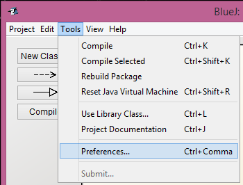
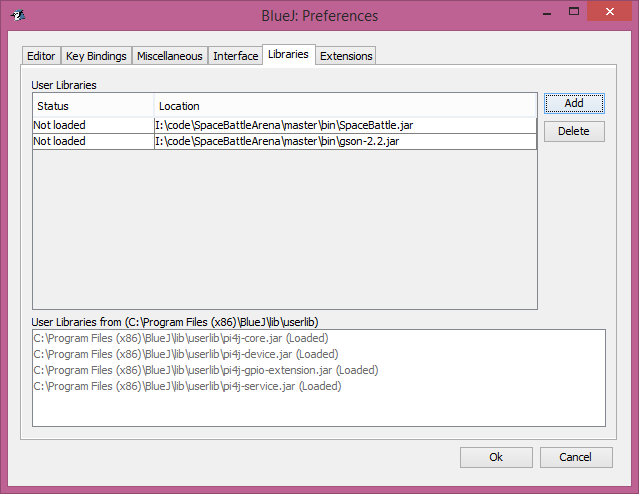
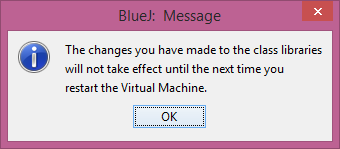
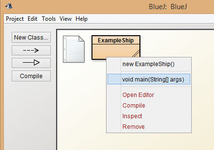

BlueJ Client Environment Setup
=====================

Overview
-----------

This document provides instructions for setting up the Java environment for developing code which controls a ship in the [Space Battle Arena](http://battlearena.mikeware.com/) (SBA) programming game.

These instructions were prepared for [BlueJ](http://www.bluej.org/) (3.1.5) and above.

Initial Environment Setup
-----------------------------

1. From the **Tools** menu select **Preferences** in the main window:

	

2. Click on the **Libraries** tab.	

3. Click on **Add**.

4. Select both the **[gson-2.2.jar]({{ site.releasepath }}/gson-2.2.jar)** and **[SpaceBattle.jar]({{ site.releasepath }}/SpaceBattle.jar)** which you should have downloaded:

	
	
5. Click **OK**

6. Click **OK** on the warning that pops up:

	
	
7. **Close and re-open BlueJ**.

Class Setup
----------------------

1. Click the **New Class...** button to add one to your project:

	
	
2. Double-click the new class to bring up the editor and extend BasicSpaceship, like the example below:

<pre><code>import java.awt.Color;

import ihs.apcs.spacebattle.*;
import ihs.apcs.spacebattle.commands.*;

public class ExampleShip extends BasicSpaceship {
    public static void main(String[] args)
    {
        TextClient.run("127.0.0.1", new ExampleShip());
    }
    
    @Override
    public RegistrationData registerShip(int numImages, int worldWidth, int worldHeight)
    {
        return new RegistrationData("Example Ship", new Color(255, 255, 255), 0);
    }
    
    @Override
    public ShipCommand getNextCommand(BasicEnvironment env)
    {
        return new IdleCommand(0.1);
    }
    
}
</code></pre>

You should be able to go to Tools -> Compile (Ctrl-K) and have no errors.
	
Execution Instructions
-------------------------

**Note: Do not terminate the program through the BlueJ UI; instead, click in the console window and type 'QUIT' to gracefully close the connection.**

1. Go to your main window and right-click on your class.
	
2. Select the main method:

	
	
3. Click OK in the Method Call dialog which appears.

4. When done, type 'QUIT' in the **Console** window to disconnect your ship:

	
